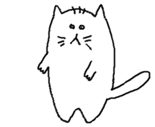
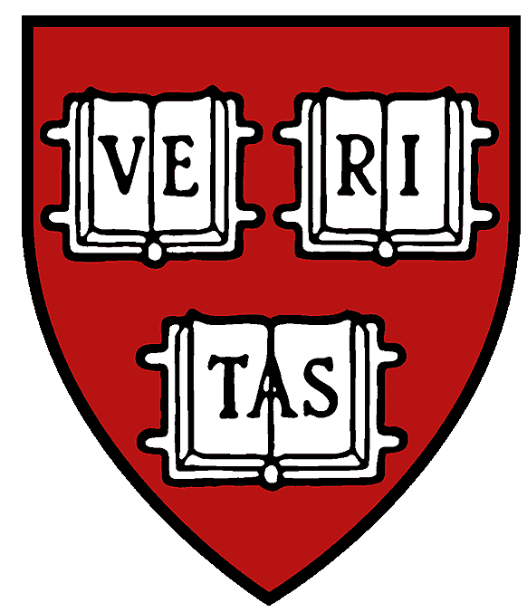

### Hi everyone! 👋

My name is David Serna, I'm from Colombia, and this is my Github profile. Here, I've been storing the source code from my projects, like crash courses or careers.
I'm Data scientist and enigneer, with background in forest sciences and GIS specialist.

If you want to get touch, here is my LinkedIn profile:   
___

### Side Projects 🧪

*  Code Abbey Solutions: I solved 31 challenges from https://www.codeabbey.com/ using experimental languages as Hy, Groovy and Reason ML. Hope this repository be helpful anytime to anybody. [Here](https://github.com/dsernag/CodeabbeySolutions) are the solutions.

*  SIATA Automation Download System: Personal project where I encourage myself to do an ETL process, automating the tedious Extract part from their website (Althoug is free —Thanks SIATA 😊), then Transform the data, making some cleaning and validation and finally Load it on a RDBMS. [Here](https://github.com/dsernag/siata_automation) is the link to the repository. Hopefully helps! The project is in development

___

### Academic Projects 📚

*  CS50's Introduction Course to Computer Science: [Here](https://github.com/dsernag/Cs50x-2021) are the solutions to all labs, problem sets and my final project. Please use it wisley.

*  Data Scientist Acámica: [Here](https://dsernag.github.io/Data_Science_Acamica/) are the four projects developed to obtain my grade.
___

