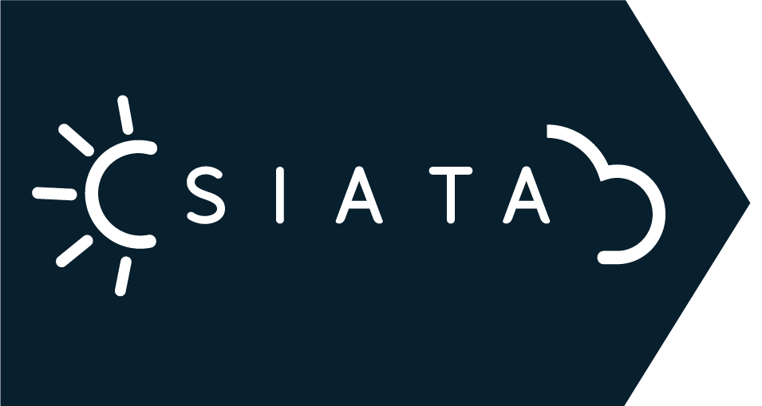

### Hey everyone! 👋

My name is David Serna, I'm from Colombia and I have been enhancing my programming skills since 2020.
This is where those hieroglyphics reside.
If you want to get touch, here is my LinkedIn profile:   
___

### Side Projects 🧪

*  Code Abbey Solutions: I solved 31 challenges from https://www.codeabbey.com/ using experimental languages as Hy, Groovy and Reason ML. Hope this repository be helpful anytime to anybody. [Here](https://github.com/dsernag/CodeabbeySolutions) are the solutions.

*  SIATA Automation Download System: Personal project where I encourage myself to do an ETL process, automating the tedious Extract part from their website (Althoug is free —Thanks SIATA 😊), then Transform the data, making some cleaning and validation and finally Load it on a RDBMS. [Here](https://github.com/dsernag/siata_automation) is the link to the repository. Hopefully helps!

___

### Academic Projects 📚

*  CS50's Introduction Course to Computer Science: [Here](https://github.com/dsernag/Cs50x-2021) are the solutions to all labs, problem sets and my final project. Please use it wisley.

*  Data Scientist Acámica: [Here](https://dsernag.github.io/Data_Science_Acamica/) are the four projects developed to obtain my grade.
___

